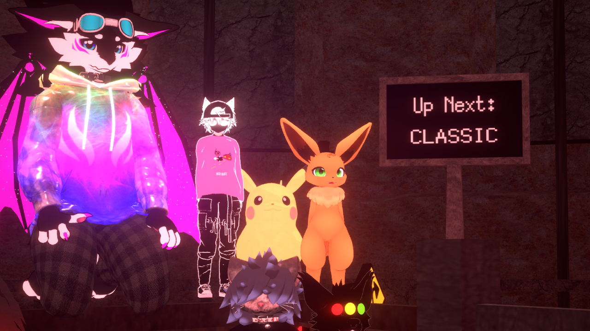
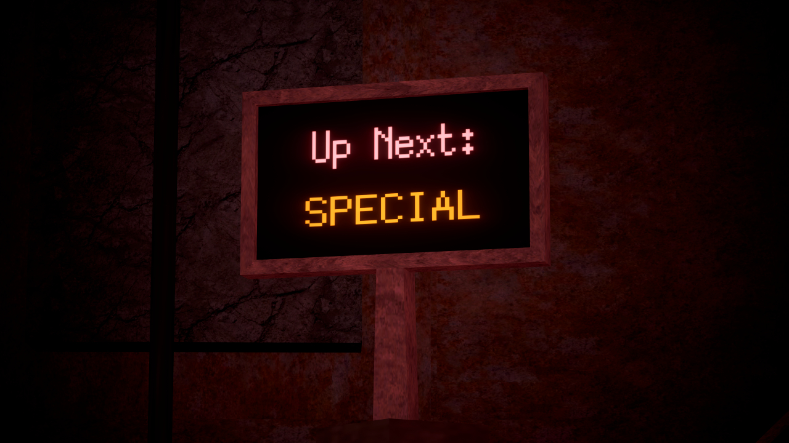
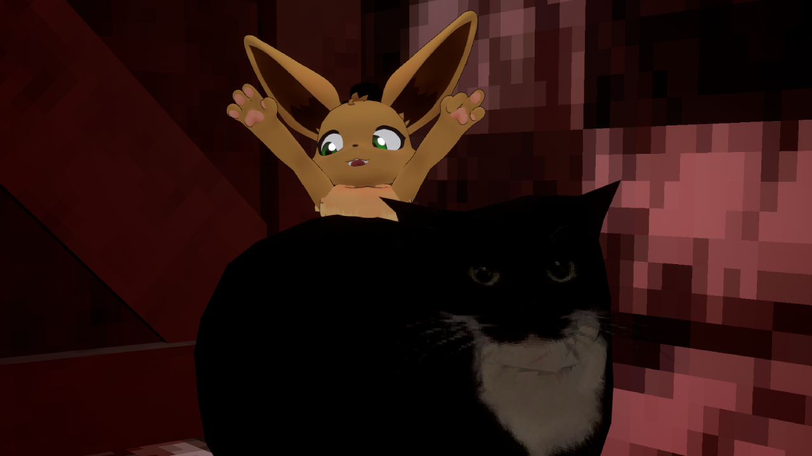
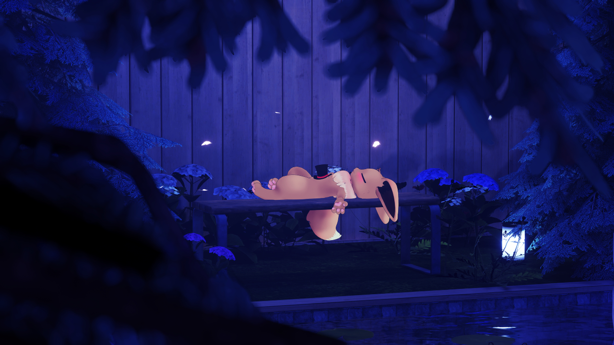

# TON-Sign
## By \~Emerald~
**TON-Sign** is a cool lil app I made for the VRChat game *Terrors of Nowhere*. This asset uses OSC to display the next round type beside the start button, meaning you should never miss another Alternate round again!

  
  

---

# [Download TON sign from the "Releases" page, or click here!](https://github.com/Emmyvee/TON-Sign/releases/tag/v2.1.0)

### 🚨 Important Notice 🚨
**This asset uses VRCFury for automatic setup. Please ensure the latest version of VRCFury is installed in your Unity project.**
[Download VRCFury Here](https://vrcfury.com/download)

---

## Setup Instructions

Setting up the TON Sign on your avatar is quick and easy:

1. **Drag the "TON Constraint" Prefab** onto your Avatar's Root.
   - This should be at the same hierarchy level as "Body," "Armature," or similar objects.
2. **✨ VRCFury Magic ✨**
   - VRCFury will automatically add the required toggle to your avatar during the upload process. No manual adjustments needed!

### Usage Notes

- **Processing Time: (IMPROVED IN NEW VERSION)** 
  - The app may need to process up to 2 rounds to accurately determine your lobby's round order!
  - On a completely fresh lobby, this may be slightly longer due to "level of suffering" but it should correct itself fast!
  
- **Existing Lobby:** 
  - If you’ve already been in the lobby for a short while before launching the app, it should automatically detect the round order without needing to process any new rounds. Just start the app and toggle the sign!

### Running the App

1. **Launch** `TONSign_Classic_or_SpecialV2.exe`.
2. **Start some rounds in Terrors of Nowhere.** 
   - The app will handle the rest!

The app also prints out some useful debug info, such as if it detects a host-change. It also shows the types of up to the last 7 rounds.

---

### Additional Information

For more details, updates, or support, please feel more than free to message me **@e.vee** on discord. This app is very much a work in progress, and the first thing like this I've ever published, so feel free to contribute or provide feedback via GitHub!

Happy TON'ing, and say HI if you see me, \~Emerald~, in game!!

  
  

